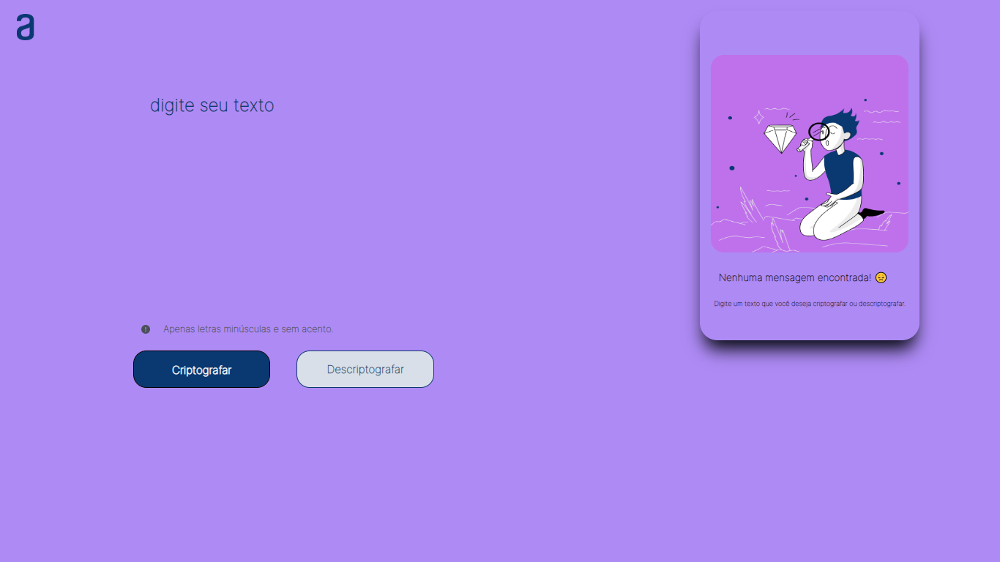

# Alura Challenge - Decodificador de Textos

> Sprint 01

Primeiro challenge realizado da trilha de iniciante em programação da Oracle Next Education.

Foi realizado um codificador e decodificador de textos com JavaScript.

[🔗 Clique aqui para acessar](https://thaynaazevedo.github.io/encriptador-alura/)

## 🎯 Tecnologias

- HTML
- CSS
- JavaScript

## 💻 Contato

thaynazevedoo@gmail.com